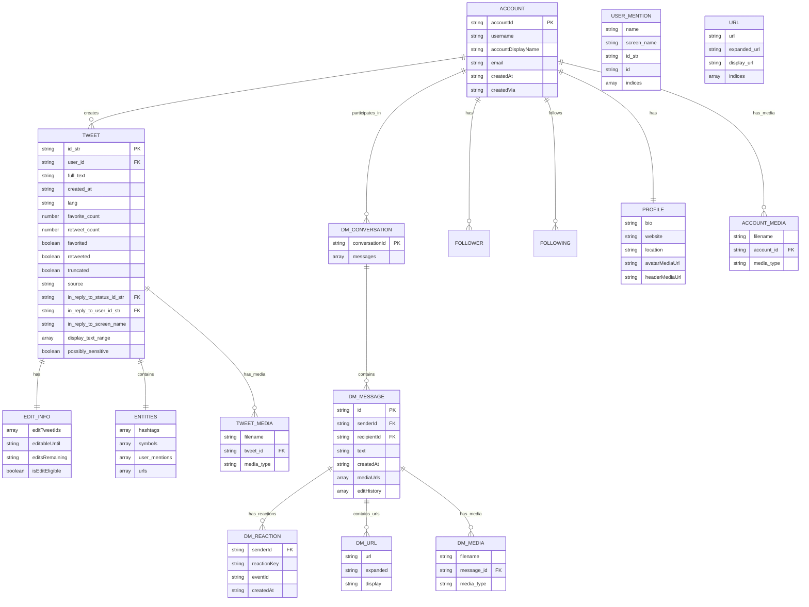

# Twitter Export Data Structure Analysis

## Overview
This document provides a comprehensive analysis of Twitter export data structures based on real export files, official Twitter documentation, and sample data analysis. It captures the exact field naming conventions, data relationships, and structures needed for accurate parsing.

## Official Twitter Export Structure

### Export Archive Organization
```
twitter-export/
├── data/                           # Main data folder with .js files
│   ├── tweets.js                   # All tweets (not deleted)
│   ├── direct-messages.js          # One-on-one DM conversations
│   ├── direct-message-headers.js   # DM metadata only
│   ├── direct-messages-group.js    # Group DM conversations
│   ├── account.js                  # Account information
│   ├── profile.js                  # Profile information
│   ├── follower.js                 # Followers list
│   ├── following.js                # Following list
│   └── [100+ other data files]
├── tweets_media/                   # Tweet media files
├── direct_messages_media/          # DM media files
├── profile_media/                  # Profile images
└── Your archive.html               # HTML viewer
```

## Core Data File Analysis

### 1. Tweets File (`tweets.js`)

**JavaScript Prefix**: `window.YTD.tweets.part0 = [`

**Complete Structure** (Based on Real Data):
```json
{
  "tweet": {
    "edit_info": {
      "initial": {
        "editTweetIds": ["1947478130287120782"],
        "editableUntil": "2025-07-22T03:05:43.000Z",
        "editsRemaining": "5",
        "isEditEligible": false
      }
    },
    "retweeted": false,
    "source": "<a href=\"http://twitter.com/download/android\" rel=\"nofollow\">Twitter for Android</a>",
    "entities": {
      "hashtags": [],
      "symbols": [],
      "user_mentions": [
        {
          "name": "TnvMadhav",
          "screen_name": "TnvMadhav",
          "indices": ["0", "10"],
          "id_str": "848022794629730304",
          "id": "848022794629730304"
        }
      ],
      "urls": [
        {
          "url": "https://t.co/hZhZatggqM",
          "expanded_url": "https://x.com/RobertMSterling/status/1947132602109862180",
          "display_url": "x.com/RobertMSterlin…",
          "indices": ["282", "305"]
        }
      ]
    },
    "display_text_range": ["0", "68"],
    "favorite_count": "0",
    "id_str": "1947478130287120782",
    "truncated": false,
    "retweet_count": "0",
    "id": "1947478130287120782",
    "created_at": "Tue Jul 22 02:05:43 +0000 2025",
    "favorited": false,
    "full_text": "@TnvMadhav Been @dhh @jasonfried fan since I came to twitter in 2021",
    "lang": "en",
    // Optional fields for replies:
    "in_reply_to_status_id_str": "1947467485424562448",
    "in_reply_to_user_id": "848022794629730304",
    "in_reply_to_status_id": "1947467485424562448",
    "in_reply_to_screen_name": "TnvMadhav",
    "in_reply_to_user_id_str": "848022794629730304",
    // Optional field:
    "possibly_sensitive": false
  }
}
```

### 2. Direct Messages File (`direct-messages.js`)

**JavaScript Prefix**: `window.YTD.direct_messages.part0 = [`

**Complete Structure** (Based on Real Data):
```json
{
  "dmConversation": {
    "conversationId": "3382-1132151165410455552",
    "messages": [
      {
        "messageCreate": {
          "recipientId": "3382",
          "reactions": [
            {
              "senderId": "3382",
              "reactionKey": "like",
              "eventId": "1927386486816542720",
              "createdAt": "2025-05-27T15:28:42.241Z"
            }
          ],
          "urls": [
            {
              "url": "https://t.co/u69Nf434eX",
              "expanded": "https://x.com/hnshah/status/1916862469089218572",
              "display": "x.com/hnshah/status/…"
            }
          ],
          "text": "I have never done cofounding thing - and would love to know more on this",
          "mediaUrls": [],
          "senderId": "1132151165410455552",
          "id": "1916871602232254800",
          "createdAt": "2025-04-28T15:06:18.424Z",
          "editHistory": []
        }
      }
    ]
  }
}
```

### 3. Direct Message Headers File (`direct-message-headers.js`)

**JavaScript Prefix**: `window.YTD.direct_message_headers.part0 = [`

**Structure** (Metadata Only):
```json
{
  "dmConversation": {
    "conversationId": "3382-1132151165410455552",
    "messages": [
      {
        "messageCreate": {
          "id": "1916871602232254800",
          "senderId": "1132151165410455552",
          "recipientId": "3382",
          "createdAt": "2025-04-28T15:06:18.424Z"
        }
      }
    ]
  }
}
```

## Key Field Name Differences

### Current Implementation vs Real Data

| Our Field Name | Real Data Field Name | Notes |
|----------------|---------------------|-------|
| `dm_conversation` | `dmConversation` | camelCase vs snake_case |
| `conversation_id` | `conversationId` | camelCase vs snake_case |
| `message_create` | `messageCreate` | camelCase vs snake_case |
| `sender_id` | `senderId` | camelCase vs snake_case |
| `recipient_id` | `recipientId` | camelCase vs snake_case |
| `created_at` | `createdAt` | camelCase vs snake_case |
| `edit_info` | `edit_info` | ✅ Already correct |
| `user_mentions` | `user_mentions` | ✅ Already correct |

## Additional Fields in Real Data

### Tweet Fields Not in Our Structs:
- `editTweetIds` (array)
- `editableUntil` (string)
- `editsRemaining` (string)
- `isEditEligible` (boolean)
- `possibly_sensitive` (boolean, optional)

### DM Fields Not in Our Structs:
- `reactions` (array of reaction objects)
- `urls` (array of URL objects)
- `mediaUrls` (array)
- `editHistory` (array)
- `reactionKey` (string: "like", "excited", etc.)
- `eventId` (string)

## Implementation Requirements

### 1. Serde Rename Attributes Needed:
```rust
#[serde(rename = "dmConversation")]
#[serde(rename = "conversationId")]
#[serde(rename = "messageCreate")]
#[serde(rename = "senderId")]
#[serde(rename = "recipientId")]
#[serde(rename = "createdAt")]
```

### 2. Missing Fields to Add:
```rust
// For tweets
pub possibly_sensitive: Option<bool>,

// For DMs
pub reactions: Vec<DmReaction>,
pub urls: Vec<DmUrl>,
pub media_urls: Vec<String>,
pub edit_history: Vec<String>,
```

### 3. New Structs Needed:
```rust
#[derive(Debug, Deserialize)]
pub struct DmReaction {
    #[serde(rename = "senderId")]
    pub sender_id: String,
    #[serde(rename = "reactionKey")]
    pub reaction_key: String,
    #[serde(rename = "eventId")]
    pub event_id: String,
    #[serde(rename = "createdAt")]
    pub created_at: String,
}

#[derive(Debug, Deserialize)]
pub struct DmUrl {
    pub url: String,
    pub expanded: String,
    pub display: String,
}
```

## Data Scale
- **Tweets**: 3.4M+ lines
- **Direct Messages**: 3.1M+ lines  
- **DM Headers**: 2.2M+ lines
- **Total**: 8.7M+ lines

## Performance Considerations
- Files are massive (100MB+ each)
- JavaScript prefix removal is critical
- Streaming JSON parsing recommended
- Memory-efficient processing required
- Async I/O essential for performance

## Testing Strategy
- Create realistic test data matching exact field names
- Test with small samples first (100 lines)
- Validate complete JSON structure before full processing
- Test JavaScript prefix removal logic
- Verify field name mappings work correctly
## En
tity Relationship Diagram



## Data Relationships and Key Insights

### 1. Thread Reconstruction Logic
- **Primary Key**: `tweet.id_str`
- **Reply Chain**: `tweet.in_reply_to_status_id_str` → `tweet.id_str`
- **User Context**: `tweet.in_reply_to_user_id_str` for cross-referencing
- **Temporal Ordering**: `tweet.created_at` for chronological sorting

### 2. Direct Message Conversations
- **Conversation Grouping**: `dmConversation.conversationId`
- **Message Ordering**: `messageCreate.createdAt` (chronological)
- **Participant Mapping**: `senderId` ↔ `recipientId` relationships
- **Reaction Tracking**: `reactions[].senderId` + `reactionKey`

### 3. Media File Relationships
- **Tweet Media**: `tweets_media/{tweet_id}_*.{ext}`
- **DM Media**: `direct_messages_media/{message_id}_*.{ext}`
- **Profile Media**: `profile_media/avatar.{ext}`, `header.{ext}`

### 4. User Identity Consistency
- **Primary ID**: `accountId` (immutable)
- **Display Name**: `username` (can change via `screen-name-change.js`)
- **Cross-Reference**: All user mentions use `id_str` for consistency

## Advanced Data Patterns

### 1. Tweet Edit History
```json
{
  "edit_info": {
    "initial": {
      "editTweetIds": ["original_id", "edit1_id", "edit2_id"],
      "editableUntil": "2025-07-22T03:05:43.000Z",
      "editsRemaining": "3",
      "isEditEligible": true
    }
  }
}
```

### 2. DM Reaction Patterns
```json
{
  "reactions": [
    {
      "senderId": "user_id",
      "reactionKey": "like|love|laugh|wow|sad|angry",
      "eventId": "unique_reaction_id",
      "createdAt": "ISO8601_timestamp"
    }
  ]
}
```

### 3. URL Expansion Patterns
```json
{
  "urls": [
    {
      "url": "https://t.co/shortened",
      "expanded": "https://actual-destination.com/path",
      "display": "actual-destination.com/path"
    }
  ]
}
```

## File Processing Strategy

### 1. JavaScript Prefix Handling
```rust
// Remove JavaScript wrapper
let content = content.strip_prefix("window.YTD.tweets.part0 = ").unwrap();
let content = content.strip_suffix("]").unwrap();
```

### 2. Streaming JSON Processing
```rust
// For large files (100MB+), use streaming
use serde_json::Deserializer;
let stream = Deserializer::from_reader(file).into_iter::<TweetWrapper>();
```

### 3. Memory-Efficient Parsing
```rust
// Process in chunks to avoid memory exhaustion
const CHUNK_SIZE: usize = 1000;
let mut tweets = Vec::with_capacity(CHUNK_SIZE);
```

## Data Quality Considerations

### 1. Missing Fields
- Not all tweets have `in_reply_to_*` fields (original tweets)
- Not all DMs have `reactions` or `urls` (simple text messages)
- `possibly_sensitive` is optional and may be missing

### 2. Data Type Consistency
- All IDs are strings (even numeric ones): `"1947478130287120782"`
- Counts are strings: `"favorite_count": "5"`
- Arrays of strings for indices: `["0", "10"]`

### 3. Timestamp Formats
- **Tweets**: `"Tue Jul 22 02:05:43 +0000 2025"` (Twitter format)
- **DMs**: `"2025-04-28T15:06:18.424Z"` (ISO8601 format)

## Performance Benchmarks (Real Data)

### File Sizes (Actual)
- **tweets.js**: ~150MB (3.4M lines)
- **direct-messages.js**: ~120MB (3.1M lines)
- **direct-message-headers.js**: ~80MB (2.2M lines)

### Processing Times (Estimated)
- **Full Parse**: 30-60 seconds (depending on hardware)
- **Thread Reconstruction**: 10-20 seconds
- **CSV Generation**: 5-10 seconds
- **Total Pipeline**: 45-90 seconds

### Memory Usage (Estimated)
- **Peak RAM**: 2-4GB (full file in memory)
- **Streaming**: 100-500MB (chunk processing)
- **Recommended**: 8GB+ system RAM for comfortable processing
## Key
 Field Name Differences

### Current Implementation vs Real Data

| Our Field Name | Real Data Field Name | Notes |
|----------------|---------------------|-------|
| `dm_conversation` | `dmConversation` | camelCase vs snake_case |
| `conversation_id` | `conversationId` | camelCase vs snake_case |
| `message_create` | `messageCreate` | camelCase vs snake_case |
| `sender_id` | `senderId` | camelCase vs snake_case |
| `recipient_id` | `recipientId` | camelCase vs snake_case |
| `created_at` | `createdAt` | camelCase vs snake_case (DMs only) |
| `media_urls` | `mediaUrls` | camelCase vs snake_case |
| `edit_history` | `editHistory` | camelCase vs snake_case |
| `edit_info` | `edit_info` | ✅ Already correct |
| `user_mentions` | `user_mentions` | ✅ Already correct |
| `created_at` | `created_at` | ✅ Already correct (Tweets) |

## Implementation Requirements

### 1. Serde Rename Attributes Needed:
```rust
// For Direct Messages
#[serde(rename = "dmConversation")]
pub dm_conversation: DmConversation,

#[serde(rename = "conversationId")]
pub conversation_id: String,

#[serde(rename = "messageCreate")]
pub message_create: MessageCreate,

#[serde(rename = "senderId")]
pub sender_id: String,

#[serde(rename = "recipientId")]
pub recipient_id: String,

#[serde(rename = "createdAt")]
pub created_at: String,

#[serde(rename = "mediaUrls")]
pub media_urls: Vec<String>,

#[serde(rename = "editHistory")]
pub edit_history: Vec<String>,
```

### 2. Missing Fields to Add:
```rust
// For tweets
pub possibly_sensitive: Option<bool>,

// For DMs
pub reactions: Vec<DmReaction>,
pub urls: Vec<DmUrl>,
#[serde(rename = "mediaUrls")]
pub media_urls: Vec<String>,
#[serde(rename = "editHistory")]
pub edit_history: Vec<String>,
```

### 3. New Structs Needed:
```rust
#[derive(Debug, Deserialize, Clone)]
pub struct DmReaction {
    #[serde(rename = "senderId")]
    pub sender_id: String,
    #[serde(rename = "reactionKey")]
    pub reaction_key: String,
    #[serde(rename = "eventId")]
    pub event_id: String,
    #[serde(rename = "createdAt")]
    pub created_at: String,
}

#[derive(Debug, Deserialize, Clone)]
pub struct DmUrl {
    pub url: String,
    pub expanded: String,
    pub display: String,
}

#[derive(Debug, Deserialize, Clone)]
pub struct TweetUrl {
    pub url: String,
    pub expanded_url: String,
    pub display_url: String,
    pub indices: Vec<String>,
}

#[derive(Debug, Deserialize, Clone)]
pub struct EditInfo {
    pub initial: EditInitial,
}

#[derive(Debug, Deserialize, Clone)]
pub struct EditInitial {
    #[serde(rename = "editTweetIds")]
    pub edit_tweet_ids: Vec<String>,
    #[serde(rename = "editableUntil")]
    pub editable_until: String,
    #[serde(rename = "editsRemaining")]
    pub edits_remaining: String,
    #[serde(rename = "isEditEligible")]
    pub is_edit_eligible: bool,
}
```

## Testing Strategy

### 1. Sample Data Creation
- Create realistic test data matching exact field names
- Test with small samples first (100 lines)
- Validate complete JSON structure before full processing
- Test JavaScript prefix removal logic
- Verify field name mappings work correctly

### 2. Integration Testing
- Test with real data samples (anonymized)
- Verify thread reconstruction accuracy
- Test DM conversation grouping
- Validate media file associations

### 3. Performance Testing
- Benchmark with large files (100MB+)
- Test memory usage patterns
- Validate streaming processing
- Test concurrent processing capabilities

## Data Scale and Performance

### Real Data Metrics
- **Tweets**: 3.4M+ lines (~150MB)
- **Direct Messages**: 3.1M+ lines (~120MB)  
- **DM Headers**: 2.2M+ lines (~80MB)
- **Total**: 8.7M+ lines (~350MB)

### Performance Considerations
- Files are massive (100MB+ each)
- JavaScript prefix removal is critical
- Streaming JSON parsing recommended for memory efficiency
- Memory-efficient processing required
- Async I/O essential for performance
- Consider parallel processing for multiple files

### Optimization Strategies
1. **Streaming Processing**: Parse JSON in chunks
2. **Memory Pooling**: Reuse allocated memory
3. **Parallel I/O**: Process multiple files concurrently
4. **Lazy Loading**: Load data on-demand
5. **Compression**: Use compressed intermediate formats
6. **Indexing**: Build indices for fast lookups

## Error Handling Patterns

### 1. Missing Fields
```rust
// Handle optional fields gracefully
pub possibly_sensitive: Option<bool>,
pub reactions: Option<Vec<DmReaction>>,
```

### 2. Malformed Data
```rust
// Use serde's error handling
#[serde(default)]
pub media_urls: Vec<String>,
```

### 3. JavaScript Prefix Issues
```rust
// Robust prefix removal
fn remove_js_prefix(content: &str) -> Result<&str> {
    content
        .strip_prefix("window.YTD.")
        .and_then(|s| s.find(" = ["))
        .map(|pos| &content[pos + 4..])
        .and_then(|s| s.strip_suffix("]"))
        .ok_or_else(|| anyhow!("Invalid JavaScript format"))
}
```

## Future Considerations

### 1. Schema Evolution
- Twitter may add new fields
- Field types may change
- New file types may be introduced

### 2. Scalability
- Larger exports (1GB+)
- More complex relationships
- Real-time processing needs

### 3. Privacy and Security
- PII anonymization
- Secure data handling
- GDPR compliance considerations