### Relative Timestamps in DM Thread Outputs

DM thread text and data outputs must include relative timestamps for each message, showing how many minutes, hours, or days have passed since the previous message in the thread. This provides context for the pacing and timing of conversations, making the output more informative and useful for analysis.

Example:
```
1754755789: Hello! [at 2025-08-09 10:00]
1234567890: Hi there! (5 minutes later) [at 2025-08-09 10:05]
1754755789: How are you? (2 hours later) [at 2025-08-09 12:05]
```
# Key Output Files

After processing, you will find these main files in each output folder:
- `threads_user_<id>.csv`: Structured tweet threads (size varies by user)
- `dm_threads_user_<id>.csv`: Structured DM threads with relative timestamps
- `timeline_analysis_user_<id>.csv`: Timeline and activity analysis

Output TXT files over 1MB are automatically split into chunks for easier upload to LLMs

# Tweet-Scrolls 📜
*Transform Twitter archives into organized conversation intelligence*

**Tweet-Scrolls processes your Twitter archive files and generates structured conversation threads and timeline analysis.** Like the Marauder's Map, it reveals organized patterns in your tweet and DM conversations.

## Input → Output

```mermaid
flowchart TD
    subgraph input ["📥 What You Provide"]
        A[📂 Twitter Archive]
        A1[📄 tweets.js]
        A2[💬 direct-messages.js]
        A3[📋 headers.js]
    end
    
    input --> process
    
    subgraph process ["⚡ Tweet-Scrolls"]
        P[🔄 Process & Analyze]
    end
    
    process --> output
    
    subgraph output ["📤 What You Get"]
        B[📊 Structured Data]
        B1[📝 Human Readable] 
        B2[📈 Timeline Analysis]
    end
    
    output --> details
    
    subgraph details ["📋 File Details"]
        B3[threads_*.csv<br/>dm_threads_*.csv<br/>timeline_analysis_*.csv]
        B4[threads_*.txt<br/>dm_threads_*.txt<br/>timeline_analysis_*.txt]
        B5[results_*.txt<br/>dm_results_*.txt]
    end
    
    style input fill:#e8f4fd
    style process fill:#fff8e1
    style output fill:#f1f8e9
    style details fill:#fdf2f8
```



### Key Capabilities
- **Thread Reconstruction**: Connects all replies into complete conversations
- **DM Organization**: Converts message threads into readable conversation flows
- **Timeline Analysis**: Shows when you're most active and interaction patterns
- **Multi-Format Output**: Generates both CSV data files and human-readable text
- **Privacy Protection**: All processing happens locally, user IDs are anonymized

## Installation & Usage

### Requirements
- Rust 1.70+ ([install here](https://rustup.rs))
- Your Twitter archive (download from Twitter/X settings)

### Quick Start
```bash
git clone https://github.com/yourusername/tweet-scrolls.git
cd tweet-scrolls
cargo build --release

# Process your archive
./target/release/tweet-scrolls /path/to/your/twitter/archive
```

### Usage Options
```bash
# Basic usage (recommended)
./target/release/tweet-scrolls /path/to/archive

./target/release/tweet-scrolls /home/amuldotexe/Desktop/GitHub202410/tweet-scrolls/REALDATA

# Custom output location
./target/release/tweet-scrolls /path/to/archive /path/to/output

# Interactive mode
./target/release/tweet-scrolls
```

## User Journey

### 🏗️ How It Works: From Raw Data to Organized Intelligence

```mermaid
flowchart TD
    A1["🔍 Discovery<br/>📂 Auto-detect files<br/>📁 Setup directories"]
    A2["🧵 Thread Building<br/>💬 Connect replies<br/>🔗 Build conversations"]
    A3["💬 DM Organization<br/>⏰ Add timestamps<br/>👥 A/B participants"]
    A4["🔐 Anonymization<br/>🔒 Blake3 hashing<br/>🛡️ Protect identity"]
    A5["📊 Data Generation<br/>📈 CSV files<br/>📝 Human-readable"]
    A6["📊 Final Output<br/>📈 Timeline analysis<br/>✅ Processing complete"]
    
    A1 --> A2
    A2 --> A3
    A3 --> A4
    A4 --> A5
    A5 --> A6
    
    style A1 fill:#e8f5e8
    style A2 fill:#e8f5e8  
    style A3 fill:#fff3e0
    style A4 fill:#fff3e0
    style A5 fill:#f3e5f5
    style A6 fill:#f3e5f5
```



**The Magic**: Like a digital archaeologist, Tweet-Scrolls discovers your Twitter archive files, intelligently reconstructs conversation threads, and transforms them into organized, readable formats - all while keeping your data safe and local.

### Thread Compilation Example

Like transforming scattered pages into a coherent storybook, Tweet-Scrolls compiles individual JSON messages into cohesive conversation threads that are easy to read and analyze.

```mermaid
flowchart TD
    subgraph Input ["📄 Raw JSON Messages"]
        A1["msg1: 'Hello!'<br/>sender: A, id: 1"]
        A2["msg2: 'Hi there!'<br/>sender: B, id: 2"]
        A3["msg3: 'How are you?'<br/>sender: A, id: 3"]
    end
    
    Input --> Processing
    
    subgraph Processing ["🧠 Transformation Engine"]
        B1["🔍 Parse Content<br/>Extract text & metadata"]
        B2["⏰ Add Timestamps<br/>Calculate relative timing"]
        B3["🧵 Thread Assembly<br/>Order chronologically"]
        B4["🔐 Anonymization<br/>Hash user identifiers"]
    end
    
    Processing --> Output
    
    subgraph Output ["💬 Organized Thread"]
        C1["A: Hello!<br/>(5 minutes later)<br/>B: Hi there!<br/>(5 minutes later)<br/>A: How are you?"]
    end
    
    Output --> Metadata
    
    subgraph Metadata ["📊 Metadata"]
        C2["• 3 messages<br/>• 10 min duration<br/>• A ↔ B participants<br/>• Blake3 anonymized"]
    end
    
    style Input fill:#ffe0e0
    style Processing fill:#fff3e0
    style Output fill:#e8f5e8
    style Metadata fill:#f0f9ff
```



**The Transformation**: Individual JSON objects become natural conversation flow with timing context and participant anonymization - perfect for review and analysis.

## File Details

| File | Content | Purpose |
|------|---------|---------|
| `threads_*.csv` | Tweet conversations with metadata | Data analysis |
| `threads_*.txt` | Human-readable tweet threads | Review conversations |
| `dm_threads_*.csv` | DM conversations with timing | Data analysis |
| `dm_threads_*.txt` | Human-readable DM threads | Review private messages |
| `timeline_analysis_*.csv` | Activity patterns and statistics | Behavioral analysis |
| `timeline_analysis_*.txt` | Activity insights and summaries | Understanding patterns |
| `results_*.txt` | Processing summary and statistics | Overview |

## Privacy & Security

**All processing happens locally** - your data never leaves your machine.

### DM Thread Output: Participant Labels vs. User IDs
By default, DM thread text outputs use simple participant labels (A, B, etc.) for readability. This makes conversations easy to follow, especially for two-person chats. If you require full transparency, you can configure the tool to output actual user IDs or screen names instead of labels. This option is available for advanced users who want to see real identifiers in their DM thread exports.

### Built-in Safety Features
- Local processing only (no network connections)
- Automatic git protection for private data
- Comprehensive .gitignore protection

```bash
# Safety check before commits
./check_data_safety.sh
```

## Performance

- Processes 50,000+ tweets efficiently
- Handles large DM archives with streaming
- Parallel processing for optimal speed
- Memory-efficient design

## Development

```bash
# Run tests
cargo test

# Check code quality
cargo clippy
```

### Architecture
- `models/` - Data structures for tweets, DMs, and analysis
- `processing/` - JSON parsing and data transformation  
- `relationship/` - Intelligence extraction and report generation
- `services/` - Timeline analysis and pattern detection

## File Splitter Utility

Split large archive files into manageable chunks, and automatically split output TXT files over 1MB after main processing:

```bash
cargo build --release --bin file-splitter
./target/release/file-splitter large_archive.js

# Custom options
./target/release/file-splitter -i tweets.js -s 5M -o chunks/

# Automatic post-processing (new requirement)
# After main processing, Tweet-Scrolls will automatically scan output folders and apply file-splitter to any output TXT files over 1MB, splitting them into manageable chunks for easier review and sharing.
```

## License

MIT License

---

*Like the Marauder's Map, Tweet-Scrolls reveals the hidden patterns in your digital world.*

## Architecture

```mermaid
graph TD
    subgraph CLI ["🖥️ CLI Layer"]
        A1["main.rs<br/>Entry point<br/>User interaction"]
        A2["cli.rs<br/>Command line interface<br/>Argument parsing<br/>Interactive mode"]
    end
    
    subgraph Processing ["⚙️ Processing Layer"]
        B1["data_structures.rs<br/>Core data structures"]
        B2["file_io.rs<br/>File input/output"]
        B3["tweets.rs<br/>Tweet parsing"]
        B4["direct_messages.rs<br/>DM parsing"]
        B5["reply_threads.rs<br/>Thread reconstruction"]
        B6["dm_threads.rs<br/>DM threading"]
    end
    
    subgraph Analysis ["🔍 Analysis Layer"]
        C1["analyzer.rs<br/>Core analysis engine"]
        C2["timeline_analyzer.rs<br/>Timeline patterns"]
        C3["relationship/analyzer.rs<br/>Relationship intelligence"]
        C4["anonymization.rs<br/>Privacy protection"]
    end
    
    subgraph Output ["📤 Output Layer"]
        D1["file_generation.rs<br/>File orchestration"]
        D2["text_generators.rs<br/>Human-readable text"]
        D3["prompts_generator.rs<br/>LLM analysis prompts"]
        D4["enhanced_csv_writer.rs<br/>CSV output"]
    end
    
    subgraph Models ["📦 Data Models"]
        E1["direct_message.rs<br/>DM structures"]
        E2["profile.rs<br/>User profiles"]
        E3["statistics.rs<br/>Statistical data"]
        E4["timeline.rs<br/>Timeline structures"]
    end
    
    CLI --> Processing
    Processing --> Analysis
    Analysis --> Output
    Models -.-> Processing
    Models -.-> Analysis
    Models -.-> Output
    
    style CLI fill:#e3f2fd
    style Processing fill:#fff3e0
    style Analysis fill:#f3e5f5
    style Output fill:#e8f5e8
    style Models fill:#fce4ec
```



## Output Analysis

*"Like organizing a messy bookshelf into a beautiful library..."*

```mermaid
flowchart TD
    subgraph Files ["📊 Generated Data Files"]
        A1["threads_*.csv<br/>Tweet conversations"]
        A2["dm_threads_*.csv<br/>DM conversations"]
        A3["timeline_analysis_*.csv<br/>Activity patterns"]
        A4["*.txt files<br/>Human-readable formats"]
    end
    
    Files --> Analysis
    
    subgraph Analysis ["📈 What You Can Discover"]
        B1["📊 Conversation patterns<br/>• Thread lengths<br/>• Response frequencies"]
        B2["⏰ Activity insights<br/>• Peak hours<br/>• Most active days"]
    end
    
    Analysis --> Privacy
    
    subgraph Privacy ["🔐 Privacy Protected"]
        C1["🔒 Blake3 anonymization<br/>🛡️ Local processing<br/>🚫 No network calls"]
    end
    
    style Files fill:#e3f2fd
    style Analysis fill:#fff3e0
    style Privacy fill:#fdf2f8
```



**The Result**: Your digital conversations become organized, structured data that preserves conversation flow and timing while protecting your privacy through local processing and anonymization.

---

*Like the Marauder's Map, Tweet-Scrolls reveals the hidden patterns in your digital world.*