# Tweet-Scrolls 📜
*Transform Twitter archives into organized conversation intelligence*

**Tweet-Scrolls processes your Twitter archive files and generates structured conversation data with relationship analysis.** Like the Marauder's Map, it reveals hidden patterns in your digital interactions.

## Input → Output

```mermaid
graph TB
    subgraph Input ["📥 What You Provide"]
        A["📂 your-twitter-archive/"]
        A --> B["📄 tweets.js<br/>Your tweet history"]
        A --> C["💬 direct-messages.js<br/>Private conversations"]
        A --> D["📋 direct-message-headers.js<br/>Conversation metadata"]
    end
    
    subgraph Output ["📤 What You Get"]
        E["📁 output_username_timestamp/"]
        E --> F["📊 threads_*.csv<br/>Tweet conversations (structured)"]
        E --> G["📝 threads_*.txt<br/>Tweet conversations (readable)"]
        E --> H["💬 dm_threads_*.csv<br/>DM conversations (structured)"]
        E --> I["💭 dm_threads_*.txt<br/>DM conversations (readable)"]
        E --> J["📈 timeline_analysis_*.csv<br/>Activity patterns (structured)"]
        E --> K["📋 timeline_analysis_*.txt<br/>Activity insights (readable)"]
        E --> L["👥 relationship_profiles_*/<br/>Individual relationship analysis"]
        L --> M["📄 user_*_profile.txt<br/>Per-person interaction history"]
        L --> N["⏰ interaction_timeline.txt<br/>Chronological activity log"]
        L --> O["🤖 llm_analysis_prompts.txt<br/>AI-ready analysis questions"]
    end
    
    Input --> Output
    
    style Input fill:#e1f5fe
    style Output fill:#f3e5f5
```



### Key Capabilities
- **Thread Reconstruction**: Connects all replies into complete conversations
- **DM Organization**: Converts message threads into readable conversation flows
- **Relationship Mapping**: Identifies your most frequent interaction partners
- **Timeline Analysis**: Shows when you're most active and interaction patterns
- **Privacy Protection**: All processing happens locally, user IDs are anonymized

## Installation & Usage

### Requirements
- Rust 1.70+ ([install here](https://rustup.rs))
- Your Twitter archive (download from Twitter/X settings)

### Quick Start
```bash
git clone https://github.com/yourusername/tweet-scrolls.git
cd tweet-scrolls
cargo build --release

# Process your archive
./target/release/tweet-scrolls /path/to/your/twitter/archive
```

### Usage Options
```bash
# Basic usage (recommended)
./target/release/tweet-scrolls /path/to/archive

# Custom output location
./target/release/tweet-scrolls /path/to/archive /path/to/output

# Interactive mode
./target/release/tweet-scrolls
```

## User Journey

### 🏗️ How It Works: From Raw Data to LLM-Ready Gold

```mermaid
flowchart LR
    subgraph Step1 ["🔍 Step 1: Discovery"]
        A1["📂 Auto-detect files<br/>• tweets.js<br/>• direct-messages.js<br/>• headers.js"]
        A2["📁 Create output directory<br/>• Timestamped naming<br/>• Safe file structure"]
        A3["🛡️ Initialize privacy<br/>• Local processing only<br/>• No network calls"]
    end
    
    subgraph Step2 ["🧠 Step 2: Processing"]
        B1["🧵 Thread Building<br/>• Connect all replies<br/>• Build conversations"]
        B2["💬 DM Organization<br/>• Add timestamps<br/>• Smart timing<br/>• A/B participants"]
        B3["🔐 Anonymization<br/>• Blake3 hash user IDs<br/>• Protect identity"]
    end
    
    subgraph Step3 ["🎯 Step 3: Intelligence"]
        C1["📊 CSV Data Files<br/>• Structured data<br/>• Analysis ready"]
        C2["📝 Human-Readable<br/>• Natural flow<br/>• Conversation style"]
        C3["🤖 LLM Prompts<br/>• Relationship maps<br/>• Behavioral patterns<br/>• AI analysis"]
    end
    
    Step1 --> Step2
    Step2 --> Step3
    
    style Step1 fill:#e8f5e8
    style Step2 fill:#fff3e0
    style Step3 fill:#f3e5f5
```



**The Magic**: Like a digital archaeologist, Tweet-Scrolls discovers your Twitter archive files, intelligently reconstructs conversation threads, and transforms them into LLM-ready insights - all while keeping your data safe and local.

### Thread Compilation Example

Like transforming scattered pages into a coherent storybook, Tweet-Scrolls compiles individual JSON messages into cohesive conversation threads that are easily digestible by Large Language Models.

```mermaid
flowchart TD
    subgraph Input ["📄 Raw JSON Messages"]
        A1["msg1: 'Hello!'<br/>sender: A<br/>id: 1"]
        A2["msg2: 'Hi there!'<br/>sender: B<br/>id: 2"]
        A3["msg3: 'How are you?'<br/>sender: A<br/>id: 3"]
    end
    
    subgraph Processing ["🧠 Transformation Engine"]
        B1["🔍 Parse Content<br/>Extract text & metadata"]
        B2["⏰ Add Timestamps<br/>Calculate relative timing"]
        B3["🧵 Thread Assembly<br/>Order chronologically"]
        B4["🔐 Anonymization<br/>Hash user identifiers"]
    end
    
    subgraph Output ["💬 LLM-Ready Thread"]
        C1["A: Hello!<br/>(5 minutes later)<br/>B: Hi there!<br/>(5 minutes later)<br/>A: How are you?"]
        C2["📊 Metadata:<br/>• 3 messages<br/>• 10 min duration<br/>• A ↔ B participants<br/>• Blake3 anonymized"]
    end
    
    Input --> Processing
    Processing --> Output
    
    A1 --> B1
    A2 --> B2
    A3 --> B3
    B1 --> B4
    B2 --> B4
    B3 --> B4
    B4 --> C1
    B4 --> C2
    
    style Input fill:#ffe0e0
    style Processing fill:#fff3e0
    style Output fill:#e8f5e8
```



**The Transformation**: Individual JSON objects become natural conversation flow with timing context and participant anonymization - perfect for LLM analysis and pattern recognition.

## File Details

| File | Content | Purpose |
|------|---------|---------|
| `threads_*.csv` | Tweet conversations with metadata | Data analysis |
| `threads_*.txt` | Human-readable tweet threads | Review conversations |
| `dm_threads_*.csv` | DM conversations with timing | Data analysis |
| `dm_threads_*.txt` | Human-readable DM threads | Review private messages |
| `timeline_analysis_*.csv` | Activity patterns and statistics | Behavioral analysis |
| `timeline_analysis_*.txt` | Activity insights and summaries | Understanding patterns |
| `relationship_profiles_*/` | Individual relationship analysis | AI-ready insights |

## Privacy & Security

**All processing happens locally** - your data never leaves your machine. User IDs are anonymized using Blake3 hashing for privacy protection.

### Built-in Safety Features
- Local processing only (no network connections)
- Automatic git protection for private data
- Blake3 anonymization for user identifiers
- Comprehensive .gitignore protection

```bash
# Safety check before commits
./check_data_safety.sh
```

## Performance

- Processes 50,000+ tweets efficiently
- Handles large DM archives with streaming
- Parallel processing for optimal speed
- Memory-efficient design

## Development

```bash
# Run tests
cargo test

# Check code quality
cargo clippy
```

### Architecture
- `models/` - Data structures for tweets, DMs, and analysis
- `processing/` - JSON parsing and data transformation  
- `relationship/` - Intelligence extraction and report generation
- `services/` - Timeline analysis and pattern detection

## File Splitter Utility

Split large archive files into manageable chunks:

```bash
cargo build --release --bin file-splitter
./target/release/file-splitter large_archive.js

# Custom options
./target/release/file-splitter -i tweets.js -s 5M -o chunks/
```

## License

MIT License

---

*Like the Marauder's Map, Tweet-Scrolls reveals the hidden patterns in your digital world.*

## Architecture

```mermaid
graph TD
    subgraph CLI ["🖥️ CLI Layer"]
        A1["main.rs<br/>Entry point<br/>User interaction"]
        A2["cli.rs<br/>Command line interface<br/>Argument parsing<br/>Interactive mode"]
    end
    
    subgraph Processing ["⚙️ Processing Layer"]
        B1["data_structures.rs<br/>Core data structures"]
        B2["file_io.rs<br/>File input/output"]
        B3["tweets.rs<br/>Tweet parsing"]
        B4["direct_messages.rs<br/>DM parsing"]
        B5["reply_threads.rs<br/>Thread reconstruction"]
        B6["dm_threads.rs<br/>DM threading"]
    end
    
    subgraph Analysis ["🔍 Analysis Layer"]
        C1["analyzer.rs<br/>Core analysis engine"]
        C2["timeline_analyzer.rs<br/>Timeline patterns"]
        C3["relationship/analyzer.rs<br/>Relationship intelligence"]
        C4["anonymization.rs<br/>Privacy protection"]
    end
    
    subgraph Output ["📤 Output Layer"]
        D1["file_generation.rs<br/>File orchestration"]
        D2["text_generators.rs<br/>Human-readable text"]
        D3["prompts_generator.rs<br/>LLM analysis prompts"]
        D4["enhanced_csv_writer.rs<br/>CSV output"]
    end
    
    subgraph Models ["📦 Data Models"]
        E1["direct_message.rs<br/>DM structures"]
        E2["profile.rs<br/>User profiles"]
        E3["statistics.rs<br/>Statistical data"]
        E4["timeline.rs<br/>Timeline structures"]
    end
    
    CLI --> Processing
    Processing --> Analysis
    Analysis --> Output
    Models -.-> Processing
    Models -.-> Analysis
    Models -.-> Output
    
    style CLI fill:#e3f2fd
    style Processing fill:#fff3e0
    style Analysis fill:#f3e5f5
    style Output fill:#e8f5e8
    style Models fill:#fce4ec
```



## LLM Assimilation Journey

*"Like the Sorting Hat understanding a student's mind..."*

```mermaid
graph TB
    subgraph Files ["📊 Generated Data Files"]
        A1["threads_*.csv<br/>Tweet conversations<br/>(structured)"]
        A2["dm_threads_*.csv<br/>DM conversations<br/>(structured)"]
        A3["timeline_analysis_*.csv<br/>Activity patterns<br/>(structured)"]
        A4["*.txt files<br/>Human-readable<br/>formats"]
    end
    
    subgraph Questions ["🧠 Ready-Made Analysis Questions"]
        B1["'Who do I interact<br/>with most frequently?'"]
        B2["'When am I<br/>most active?'"]
        B3["'How has my communication<br/>style evolved?'"]
        B4["'What are my<br/>conversation patterns?'"]
    end
    
    subgraph Intelligence ["🎯 LLM-Ready Intelligence"]
        C1["📈 Relationship Analysis<br/>• Interaction frequency<br/>• Communication patterns"]
        C2["⏰ Timeline Patterns<br/>• Peak activity hours<br/>• Response timing"]
        C3["🔍 Behavioral Insights<br/>• Style evolution<br/>• Pattern recognition"]
        C4["🔐 Privacy Protected<br/>• Blake3 anonymization<br/>• Local processing"]
    end
    
    Files --> Intelligence
    Questions --> Intelligence
    
    A1 --> C1
    A2 --> C1
    A3 --> C2
    A4 --> C3
    
    B1 --> C1
    B2 --> C2
    B3 --> C3
    B4 --> C3
    
    style Files fill:#e3f2fd
    style Questions fill:#fff3e0
    style Intelligence fill:#e8f5e8
```



**The Result**: Your digital conversations become structured intelligence that LLMs can analyze for relationship patterns, behavioral insights, and communication evolution - all with privacy-first anonymization.

---

*Like the Marauder's Map, Tweet-Scrolls reveals the hidden patterns in your digital world.*